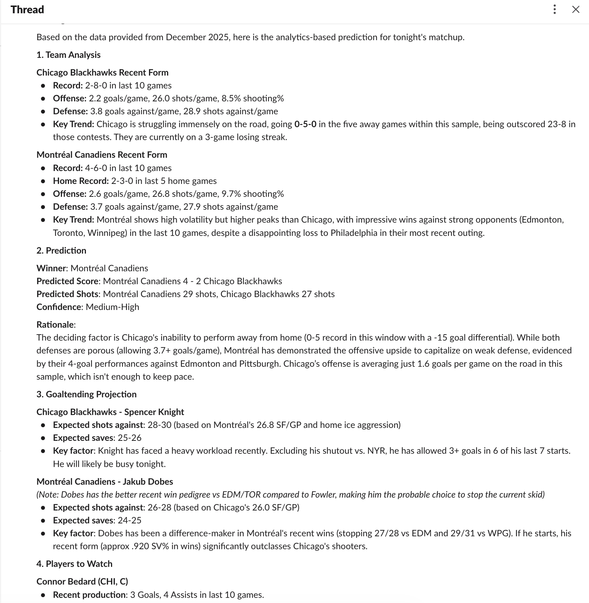

# Building a NHL Game Predictor with Gemini

## Motivation

I built Herald to simplify the process of understanding team and player patterns over their last set of games. In building this, I evaluted various technologies, and ultimately, selected combination of Gemini and a simple API to feed data to the model. An alternative approach was to use MCP Toolbox for Databases. Since I already had an API providing the data I needed, I opted for this route over tieing the LLM into my database directly.

## How Herald Works

Herald is designed to natively integrate into Slack. Each day, Herald will run and will post a new channel message for the day and will then post each game as a thread message. This keeps the channel organized by date.

To achieve this, when Herald is run, it starts by building a list of all the games set to be played that day. That data is currently being pulled from the NHL API. The next step is then to build a list of recent game data on all the teams that are playing that night. This data is pulled from an internal API I've built that contains deep team and player analytics for every game played in the last 6 seasons.

After this is done, we have a list of `Game` models that contain the following:
    - home team
    - home team's last 10 game statistics including individual player performance for each game
    - away team
    - away team's last 10 game statistics including individual player performance for each game

Each model is then fed to Gemini to conduct an analysis and prediction for the upcoming game - including game result, goaltending predictions, and key players to watch for. The prompt has a well defined structure and can be found in the settings module.

Currently Gemini 3 Pro (gemini-3-pro) model is being used. I plan to begin testing with Gemini 3 Flash which has been recently introduced.

Once Gemini builds the analysis, it will post the game as a thread to the day's message. This process is iterated for each game.

Below is a sample output of a single game:

## Building Herald

Herald is built as a simple Python application that leverages the following libraries:

- [Requests](https://requests.readthedocs.io/en/latest/): Used to interact with the NHL API and my internal game data API
- [Google GenAI](https://github.com/googleapis/python-genai): Used to interact with Gemini and return future game analysis
- [Slack SDK](https://github.com/slackapi/python-slack-sdk): Used to post analytics to a Slack channel

Herald is meant to be built and run as a container. A Dockerfile is provided and is built an internal GitLab pipeline (not shown in this repository).

## Deploying Herald

Herald is deployed as a Kubernetes CronJob and runs daily at 1:00 PM EST. The reason behind the time and it being later in the day allows more time for the starting goalie of each team to be confirmed. The CronJob YAML can be found in the `kubernetes` directory.

## Results & Future Road Map

The overall results from Gemini are quite impressive. Its ability to understand how statistics and key performances carry different weights in a game is facinating and I've found myself looking forward to reading how the model reads a game based purely from a numbers perspective. I found it was very good at understanding advanced metrics like Corsi scores.

Currently, the model does not have a view into confirmed starting goaltenders in a game. This will be an upcoming feature to try and retrieve this data before creating an analysis. Another room for improvement is feeding it more contextual data such as historic match-ups between the two teams. Furthermore, prodviding reacher insight at the player level so the model is able to have deeper context in what it means to a player playing against a specific team.